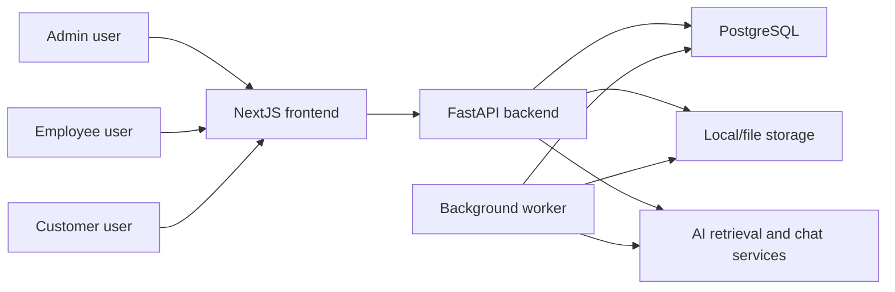
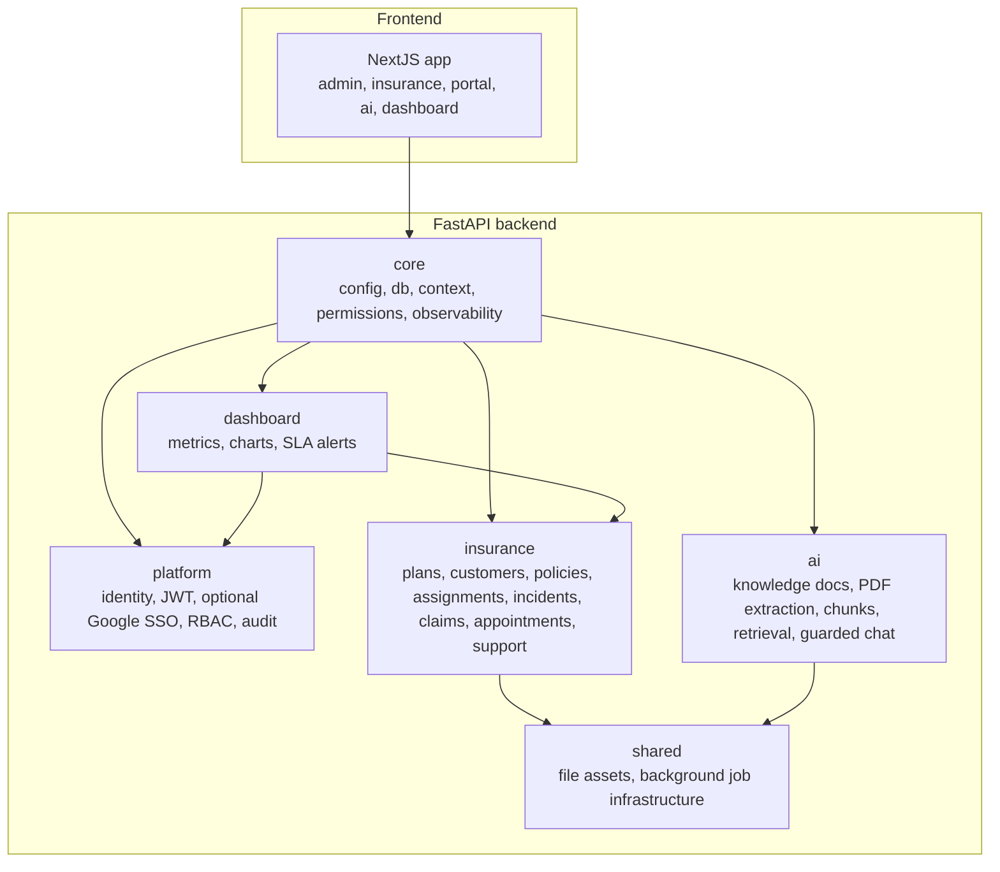

# Insurance Operations Platform - Production Architecture Portfolio

This document presents the production architecture for an insurance operations platform. It is written as a portfolio-grade architecture record: first mapping business requirements to the solution, then documenting non-functional targets, key architecture decisions, module boundaries and implementation status.

`docs/PLAN.md` remains the execution backlog. This file defines the target architecture, implemented boundaries and design rules future agents must preserve.

## Executive Summary

The platform supports an insurance company with admins, employees and customers. It covers policy/customer operations, incident reporting, claim lifecycle management, employee workload queues, customer self-service, AI-assisted support and operational dashboards.

The architecture intentionally uses a **modular monolith** rather than microservices. This keeps local development, transactional consistency and deployment simple while still demonstrating enterprise boundaries through modules: `platform`, `insurance`, `ai`, `dashboard`, `shared` and `core`.

## Requirement Mapping

| Business requirement | Architecture module | API/UI surface | Security and performance concern |
| --- | --- | --- | --- |
| Admin manages users, roles and audit history | `platform` | `/me`, `/admin/users`, `/admin/audit-events`, Google SSO adapter | JWT/RBAC, audit metadata redaction, admin-only routes |
| Employee manages assigned customers and work | `insurance` | `/insurance`, `/insurance/queues/my`, queue detail/action APIs | Object-level authorization, bounded queue lists, priority/due indexes |
| Customer views policies and support context | `insurance` | `/portal`, portal summary/history APIs | Customer resolved from trusted actor, no client-supplied `customer_id` |
| Customer reports incident/claim | `insurance` | incident APIs, claim detail UI | Tenant-scoped create/read, claim state machine, PII-safe audit |
| Claim progresses through governed lifecycle | `insurance` | claim detail/history/transition APIs | Explicit valid transitions, role checks, transition history |
| Support conversation persists across sessions | `insurance` | `/ai`, conversation/message APIs | Customer/employee visibility rules, bounded message history |
| Chatbot answers only from company knowledge base | `ai` + `insurance` orchestration | `/ai/chat`, retrieval search, AI-assisted support message send | Tenant-scoped retrieval, bounded context/citations, safe no-source fallback |
| Dashboard shows operational health | `dashboard` | `/dashboard/summary`, `/dashboard/charts`, `/dashboard/alerts` | Aggregate queries, compact DTOs, admin-only alert list |
| SLA highlights overdue insurance work | `dashboard` + background job | Claim overdue, appointment overdue and unanswered support conversation alerts | Idempotent alert creation, no duplicate active alerts |

## Feature Specification Matrix

| Feature | Short Description | JTBD | Compliance / Standards | Acceptance Criteria |
| --- | --- | --- | --- | --- |
| Insurance Plan Management | Admin configures insurance plans, premium, benefits narrative and active/inactive lifecycle. | When the company publishes or updates insurance products, admins need a controlled plan catalog so employees can advise customers against the correct products. | RBAC, audit log, no hard delete for plans referenced by active policies, bounded list endpoints. | Admin can create/list plans; plan changes are audit-ready; active plan deletion is avoided by lifecycle status; list APIs are tenant-scoped and bounded. |
| Customer and Policy Management | Employees/admins manage customer profiles and the policies a customer has enrolled in. | When a customer joins an insurance product, staff need one trusted view of customer identity, policy status and assignment ownership. | Tenant isolation, object-level authorization, PII-safe logging, DTO-only API responses. | Customer sees only own portal data; employee sees assigned customers; admin sees tenant-wide data; every query filters by `organization_id`; PII is not written into audit metadata unnecessarily. |
| Employee Assignment and Workload Queue | The system assigns customers/cases to employees and projects actionable work into a queue. | When a customer, claim, appointment or conversation needs attention, the platform must route it to the right employee with priority and due-date context. | RBAC, bounded list, projection query, SLA-ready `due_at`, priority/status indexes. | Employee sees own queue; admin can inspect tenant queue; queue can filter by status/priority; queue sorts by due date/priority; service tests cover object scope and mutation permissions. |
| Incident Reporting and Claim Lifecycle | Customer incident reports become claims governed by an explicit state machine. | When a customer reports an incident, they need transparent progress tracking while employees need valid operational transitions. | State machine, audit trail, PII minimization, role-based transition, no arbitrary status mutation. | Incident starts at `reported`; only employee/admin can transition; invalid transitions return errors; transition reason is required; transition history is persisted and tenant-scoped. |
| Appointment and Support Conversation | Customers can request appointments and keep persistent support conversations with assigned employees. | When customers need support, they need a reusable thread or appointment path instead of one-off messages that lose context. | Object authorization, message pagination, customer/employee visibility rules, idempotent command target. | Customer can request appointment and start conversation; conversation persists; employee sees assigned/customer-scoped threads; message history is bounded; retry-safe behavior is required before production traffic. |
| AI Knowledge Chatbot | Chatbot answers from company knowledge documents and can store assistant replies in support conversations. | When customers or employees ask about procedures or products, AI should respond quickly from trusted company knowledge without inventing policy or claim decisions. | Tenant-scoped RAG, bounded retrieval context, citations, safe no-source fallback, raw prompt redaction. | Retrieval filters by tenant; answer uses bounded chunks; citations are stored as safe references; no-source fallback is deterministic; AI never approves/rejects claims or creates policy decisions. |
| Admin, RBAC and Audit | Admin controls users, roles, reset flows and audit visibility. | When operating the platform, admins need least-privilege access control and traceability for important actions. | JWT, RBAC, optional Google SSO adapter, least privilege, audit metadata redaction. | Admin can manage users and request password reset; auth context comes from JWT in production; audit excludes tokens, raw prompts, full claim descriptions and full support message bodies. |
| Dashboard and Analytics | Role-aware dashboard exposes cards, chart-ready series and SLA alert lists. | When users log in, they need immediate operational insight without the frontend computing sensitive aggregates. | Role-based data visibility, aggregate SQL/read model, read-only dashboard, compact DTOs. | Dashboard returns summary metrics; charts use stable label/value DTOs; alerts are admin-only; dashboard never mutates insurance workflows; source queries remain tenant-scoped. |
| SLA Monitoring | Background evaluation creates alerts for overdue claims, appointments and support conversations. | When work exceeds expected handling time, operations leads need active alerts that do not duplicate across repeated evaluations. | Background job isolation, idempotent active alert creation, tenant-scoped alert records, source-resource links. | SLA evaluation can run repeatedly without duplicate active alerts; resolved/closed workflow items stop active alerts; alerts link to authorized claim, queue or conversation contexts. |

## Business Capability Matrix

| Capability | JTBD | Success KPI | Primary Risk | Mitigation | Owner |
| --- | --- | --- | --- | --- | --- |
| Claim Processing | Move customer incidents from report to resolution with transparent state and accountability. | Average claim resolution time under 5 working days; 100% transitions auditable; rejected claim dispute rate under 3%. | Invalid transition or missing decision trace. | Claim state machine, transition reason, audit trail, tenant-scoped history. | `insurance` |
| Customer Self-Service | Let customers view coverage, claims, appointments and support threads without calling staff for basic status. | 60%+ routine status checks resolved through portal; portal read P95 under 300 ms. | Customer sees another tenant/customer record. | Linked customer resolution from trusted actor, no client-supplied customer authorization, portal DTO projection. | `insurance` |
| Employee Workload Management | Give employees a prioritized work queue for assigned customers and cases. | No overdue work item older than 7 days; workload distribution within +/-20% across active employees. | Work imbalance or missed task. | Assignment model, priority/due fields, bounded queue, SLA alerting. | `insurance` + `dashboard` |
| Customer Support | Preserve appointment and conversation history across support interactions. | First response under 4 hours; unresolved support conversations older than 1 business day flagged. | Missed conversation or unauthorized thread access. | Conversation visibility rules, message pagination, support SLA alerts. | `insurance` |
| Knowledge Chatbot | Deflect repetitive support questions using trusted company knowledge. | 80%+ answer usefulness for knowledge-backed questions; 0 unsupported claim/policy decisions by AI. | Hallucination, stale knowledge or prompt injection. | Tenant-scoped RAG, citations, bounded context, deterministic fallback. | `ai` |
| Operational Dashboard | Surface portfolio health to managers without exposing workflow mutation paths. | Dashboard summary P95 under 300 ms; active SLA alerts visible to admins. | Expensive aggregation or unauthorized metric exposure. | Aggregate queries, role gates, compact chart DTOs, no dashboard commands. | `dashboard` |
| Governance and Audit | Make critical actions traceable without leaking sensitive content. | 100% critical commands have actor/tenant/resource audit; 0 tokens/raw prompts/full support messages in audit metadata. | Sensitive data leakage through logs/audit. | PII minimization, safe metadata, trace id middleware, RBAC. | `platform` |

## Feature Risk Register

| Area | Risk | Impact | Mitigation | Residual Risk |
| --- | --- | --- | --- | --- |
| Claim lifecycle | Invalid state transition or skipped review step. | Wrong claim decision, audit gap, customer dispute. | Explicit transition matrix, role checks, required reason, persisted transition history. | Idempotency key for repeated transition requests remains a production hardening item. |
| Claim intake | Duplicate incident/claim submission. | Duplicate work and customer confusion. | Tenant-scoped incident records, audit trail, planned idempotency key/natural duplicate detection. | Duplicate detection is documented but not fully implemented for every command. |
| Customer portal | Cross-customer or cross-tenant data exposure. | Severe privacy and compliance issue. | Customer resolved from linked user; all queries filter `organization_id` and `customer_id`; object authorization tests. | Real production auth integration must replace demo headers. |
| Employee queue | N+1 queries or unbounded queue reads. | Slow operations dashboard and employee workspace. | Bounded list endpoints, projection DTOs, query/index budget. | Query-plan validation should be repeated with production-scale data. |
| AI chatbot | Hallucinated answer or unauthorized knowledge leakage. | Wrong policy guidance or data breach. | Tenant-scoped retrieval, bounded chunks, citations, no-source fallback, no claim/policy decisions by AI. | External provider timeout/error policy must be enforced when provider integration is added. |
| Support conversation | Duplicate messages on retry or unauthorized thread access. | Confusing support history or privacy incident. | Conversation object authorization, bounded message history, idempotency requirement. | Message idempotency key is planned before external production traffic. |
| Dashboard/SLA | Duplicate active SLA alerts. | Alert fatigue and poor operational trust. | SLA evaluation dedupe by active alert target, idempotent job behavior tests. | Ownership/assignment-specific alert routing can be refined. |
| Audit/logging | PII, raw prompts or tokens stored in logs. | Compliance breach. | Safe metadata rules, audit redaction policy, no raw prompt/full message/full claim narrative in audit. | Retention enforcement is a policy target, not fully automated in current code. |

## Domain Events

The current implementation uses service calls and audit records inside a modular monolith. The following domain events define the target event vocabulary for future internal event dispatch or background processing. Kafka is not required; these events can be in-process, outbox-backed or job-backed.

| Event | Producer | Consumers | Purpose |
| --- | --- | --- | --- |
| `PolicyActivated` | `insurance` policy workflow | Dashboard, audit, notification adapter | Update active coverage metrics and create traceability for policy activation. |
| `CustomerAssigned` | `insurance` assignment workflow | Queue, dashboard, audit | Refresh employee workload and support ownership. |
| `IncidentReported` | `insurance` incident workflow | Queue, claim lifecycle, dashboard, SLA, audit | Create actionable claim work and customer-visible status. |
| `ClaimTransitioned` | `insurance` claim lifecycle | Dashboard, SLA, audit, support conversation context | Update claim timeline, metrics and overdue evaluation. |
| `AppointmentRequested` | `insurance` portal/support workflow | Queue, SLA, audit, notification adapter | Create employee follow-up work and appointment SLA tracking. |
| `SupportConversationStarted` | `insurance` support workflow | Queue, SLA, audit, AI assistance orchestration | Track open support demand and conversation ownership. |
| `SupportMessageSent` | `insurance` support workflow | SLA, AI orchestration, audit-safe telemetry | Update last activity and optionally trigger AI assistance. |
| `KnowledgeDocumentIngested` | `ai` knowledge workflow | Retrieval index, audit, admin dashboard | Make uploaded knowledge searchable for tenant-scoped RAG. |
| `SlaAlertRaised` | `dashboard` SLA evaluator | Dashboard, notification adapter, audit | Surface overdue claim/appointment/conversation work. |
| `SlaAlertResolved` | `dashboard` SLA evaluator | Dashboard, audit | Remove noise when work is completed or no longer breached. |

## Regulatory and Insurance Compliance

This project is not a certified compliance product. The architecture is designed to be ready for common insurance and privacy controls.

### Data Protection

- GDPR/PDPA-ready principle: collect and expose the minimum customer data needed for the workflow.
- Tenant-owned data must be scoped by `organization_id`.
- Customer authorization must be derived from trusted actor context, not client-provided identifiers.
- PII should be represented by ids/references in audit metadata wherever possible.

### Auditability

- Claim transitions must be auditable with actor, tenant, previous state, new state and reason metadata.
- Admin actions such as user creation and password reset request must be auditable.
- AI-assisted support responses should store safe citation ids, not raw retrieved documents or raw prompts.

### Retention Targets

- Claim records and transition history: retain for 7 years unless local regulation requires longer.
- Audit logs: retain for at least 3 years.
- Support conversations: retain according to customer support and insurance dispute policy.
- Uploaded knowledge documents: retain while active, with admin-controlled archival/removal policy.

Retention automation is a future operational control; the current code models the records and safe metadata required for retention policies.

### Security Standards

- OWASP Top 10: authorization, injection, sensitive data exposure and logging risks are explicitly addressed.
- OWASP ASVS-aligned controls: centralized auth context, RBAC, object authorization and safe error behavior.
- JWT security best practices: production tenant/user/role claims must come from signed bearer tokens.
- AI safety controls: tenant-scoped retrieval, context budget, citation requirement and deterministic fallback.

## Non-Functional Requirements

| Concern | Target | Architecture support |
| --- | --- | --- |
| Tenant isolation | 100% tenant-owned queries include `organization_id` | Request context, repository filters, tenant isolation tests |
| Read latency | P95 standard read APIs under 300 ms for normal tenant data volumes | Bounded lists, projection DTOs, index budget |
| Write latency | P95 write commands under 700 ms excluding AI/provider calls | Focused service workflows, no unbounded synchronous fan-out |
| AI answer latency | 10-15 second timeout budget with safe fallback | Bounded retrieval context, deterministic no-source response |
| List safety | No unbounded list endpoint | `limit` query params with max 100 on reviewed collection APIs |
| Authorization | Route role check plus service-level object authorization | `require_roles`, service access checks for queues/claims/conversations |
| Audit safety | No tokens, raw prompts, full support messages or full claim descriptions in audit/log metadata | PII logging rules, audit DTO discipline |
| Operational reliability | Background jobs carry tenant/resource context and are idempotent where required | Shared job infrastructure, SLA evaluation dedupe |

## Senior Architecture Decisions

### 1. Modular Monolith Over Microservices

The system uses one backend deployment and one database, but it enforces domain ownership through module boundaries. This is the right trade-off for the assignment scope: it avoids premature distributed-system complexity while still making future service extraction possible.

Decision record: [ADR 0001](adr/0001-modular-monolith-boundaries.md).

### 2. Claim Lifecycle State Machine

Incident reports become governed claim records with explicit lifecycle states and transition history. This prevents arbitrary status strings from creating invalid operational states and gives employees, customers and auditors a shared claim timeline.

Decision record: [ADR 0004](adr/0004-claim-lifecycle-ownership.md).

### 3. Guarded RAG Chatbot

The chatbot is designed to answer only from tenant-scoped company knowledge chunks. It returns bounded citations and uses a deterministic no-source fallback instead of inventing policy or claim decisions.

Decision record: [ADR 0005](adr/0005-support-chat-ai-orchestration.md).

### 4. SLA as Operational Read Model, Not Workflow Owner

Dashboard/SLA code may persist alert state, but it must not own insurance workflow mutations. SLA alerts point back to authorized source resources such as claims, appointments or support conversations.

Decision record: [ADR 0006](adr/0006-dashboard-read-model-and-sla-ownership.md).

### 5. Enterprise Auth Adapter Without Locking Core Domain Logic

Google SSO is modeled as an optional enterprise auth adapter. The core authorization model remains JWT + RBAC + tenant claims, so the insurance workflow modules do not depend on Google-specific behavior.

Decision record: [ADR 0002](adr/0002-production-auth-and-tenant-resolution.md).

## Architecture Style

The platform is a modular monolith:

- One FastAPI backend process exposes versioned REST APIs.
- One PostgreSQL database stores tenant-owned operational data.
- One NextJS frontend consumes the backend API.
- Background workers run separately but use the same backend modules and database.
- Modules are bounded by domain ownership, not by deployment unit.

Do not split modules into microservices unless a future ADR documents the reason, trade-offs, migration plan and operational cost.

## C4 Context Snapshot



## C4 Container Snapshot



The diagram shows logical dependency flow, not direct import permission for every arrow. Direct imports must follow the module dependency contract below.

## SOLID Boundaries

- Single responsibility: each service handles one workflow, such as plan management, policy enrollment, incident reporting, claim transition or retrieval chat.
- Open/closed: AI retrieval and answer flows sit behind services so new providers can be added without changing insurance workflows.
- Liskov substitution: storage, embedding and background job providers expose stable contracts.
- Interface segregation: routers depend on narrow services and schemas rather than database models directly.
- Dependency inversion: business workflows depend on repositories, provider abstractions and documented ports rather than framework details.

## Layering Rules

Every backend feature must preserve this direction:

```text
Router -> Service/Application Workflow -> Repository/Provider Port -> Model/Infrastructure
```

Rules:

- Routers handle HTTP only: request parsing, dependency injection, response model selection.
- Services own business rules, authorization decisions beyond coarse route role checks, validation and orchestration.
- Repositories own database access and tenant-scoped query construction.
- Models represent persistence state, not API contracts.
- Schemas/DTOs represent API contracts, not ORM objects.
- Services must not return ORM models directly to routers.
- Repositories must not call routers or services.
- Frontend pages must call API client functions, not duplicate backend business rules.

## Backend Modules

### `core`

Owns:

- App settings and environment mode.
- Database session construction.
- Request context and trusted auth principal access.
- Permission helpers.
- Storage interfaces and observability middleware.

Must not own:

- Insurance workflow state.
- AI retrieval business rules.
- Dashboard metrics.
- Tenant-specific operational decisions.

### `platform`

Owns:

- Organizations, users, memberships, roles and permissions.
- Optional Google SSO adapter.
- JWT session creation and validation.
- Audit and login events.
- Admin user management.

Must not own:

- Insurance policy/claim/customer workflow logic.
- AI document ingestion or chat decisions.
- Dashboard aggregation rules.

### `shared`

Owns:

- File asset infrastructure.
- Background job infrastructure.
- Reusable infrastructure primitives that are not domain workflows.

Must not own:

- Job handler business logic for insurance, AI or dashboard workflows.
- Domain-specific status machines.
- Cross-domain orchestration decisions.

### `insurance`

Owns:

- Insurance plans, customers, policies and assignments.
- Incident reports and claim lifecycle state.
- Appointments, conversations and support messages.
- Customer portal and employee workload queue source data.

Must not own:

- AI provider implementation details.
- Platform identity source of truth.
- Dashboard aggregation ownership.

### `ai`

Owns:

- Knowledge bases, documents and chunks.
- PDF extraction, chunking and retrieval.
- Guarded chat answer generation and AI chat persistence.
- AI provider abstractions.

Must not own:

- Insurance support conversation authorization.
- Claim state.
- Dashboard metrics.

### `dashboard`

Owns:

- Read-only aggregation services.
- Chart DTOs and SLA alert read surfaces.
- SLA rule/alert persistence and SLA evaluation logic.
- Dashboard-specific projections/read models when direct aggregates are no longer sufficient.

Must not own:

- Insurance workflow mutations.
- Claim state transitions.
- Conversation/message command flows.
- Platform auth/audit source state.

## Module Dependency Contract

Allowed:

- Any domain may depend on `core` for configuration, database sessions, request context primitives and observability types.
- Domains may depend on `shared` infrastructure ports for file storage and background job enqueueing.
- Routers may depend on their own domain services and schemas.
- Services may depend on their own repositories and documented cross-domain ports.
- Dashboard may read from source-domain repositories or read models, but only through read-only query contracts.
- Audit logging may be consumed as the platform audit service until an ADR replaces it with a `core` audit port.

Forbidden:

- Routers importing repositories directly.
- Frontend code relying on hardcoded tenant/customer IDs for authorization.
- Dashboard calling command services in `insurance`.
- `insurance` importing AI provider internals or retrieval storage details.
- `ai` mutating insurance conversation or claim state directly.
- Background job handlers living only in `shared` when the job business logic belongs to `insurance`, `ai` or `dashboard`.
- Cross-domain imports that create circular dependencies.

Cross-domain orchestration must use one of these patterns:

- A documented application workflow service in the owning module.
- A narrow port/interface documented in an ADR.
- A background job payload handled by the owning domain.

## Data Ownership

| Data Area | Source Module | Notes |
| --- | --- | --- |
| Organizations, users, roles, memberships | `platform` | Tenant and actor identity source of truth. |
| Audit and login events | `platform` | Shared audit consumer is allowed by current architecture. |
| Plans, customers, policies, assignments | `insurance` | Tenant-owned insurance operations data. |
| Incidents and claim lifecycle | `insurance` | Claim states and transition history belong here. |
| Appointments, conversations, messages | `insurance` | Support workflow source of truth. |
| Knowledge documents and chunks | `ai` | Retrieval must always be tenant-scoped. |
| AI chat sessions/messages | `ai` | AI-native chat state; support conversation state remains in `insurance`. |
| File assets | `shared` | Metadata and storage references only. |
| Background jobs | `shared` infrastructure, owning domain handler | Payloads must include tenant and trace context. |
| Dashboard metrics, SLA rules and SLA alerts | `dashboard` | Dashboard may persist SLA alert state but must not mutate insurance workflow source state. |

## Key Data Flows

### Customer Portal

1. Frontend calls portal APIs without passing `organization_id` or arbitrary `customer_id`.
2. Backend resolves tenant and actor from trusted request context.
3. `insurance` resolves linked customer from `linked_user_id`.
4. Portal service returns projected policies, incidents, appointments and conversations.
5. Every query is tenant-scoped and customer-scoped.

### Employee Workload Queue

1. Employee/admin calls queue API with filters and pagination.
2. `insurance` queue service applies role/object authorization.
3. Repository returns projection rows, not full graph objects.
4. Queue mutations are idempotent where retryable and emit audit events.
5. Dashboard consumes queue metrics through read-only aggregation.

### Claim Lifecycle

1. Incident reports become the source record for claim lifecycle state.
2. Claim transition service validates state matrix, actor role, required reason and tenant ownership.
3. Transition history is persisted before response.
4. Queue and dashboard views read lifecycle state; they do not own transitions.

Claim state contract:

| State | Meaning | Customer-visible | Terminal |
| --- | --- | --- | --- |
| `reported` | Incident was submitted and awaits triage. | Yes | No |
| `triage` | Employee is validating initial claim information. | Yes | No |
| `in_review` | Claim is under formal review. | Yes | No |
| `approved` | Claim was approved for next operational step. | Yes | No |
| `rejected` | Claim was rejected with a safe external reason. | Yes | Yes |
| `closed` | Claim workflow is complete. | Yes | Yes |
| `reopened` | Closed/rejected claim was reopened by an authorized actor. | Yes | No |

Allowed transitions:

| From | To | Roles | Required metadata |
| --- | --- | --- | --- |
| `reported` | `triage` | `admin`, `employee` | reason |
| `triage` | `in_review` | `admin`, `employee` | reason |
| `in_review` | `approved` | `admin`, `employee` | reason |
| `in_review` | `rejected` | `admin`, `employee` | reason |
| `approved` | `closed` | `admin`, `employee` | reason |
| `rejected` | `reopened` | `admin` | reason |
| `closed` | `reopened` | `admin` | reason |
| `reopened` | `triage` | `admin`, `employee` | reason |

Invalid transitions must be rejected before persistence. Customer role may read scoped claim state but may not transition claims.

### Persisted Support Chat with AI

1. `insurance` owns customer support conversation and message authorization.
2. A documented orchestration service requests guarded AI assistance through an `ai` contract.
3. `ai` retrieval is tenant-scoped and returns bounded citations.
4. Assistant responses are stored in the relevant conversation without logging raw prompts or sensitive message bodies.

AI guardrails:

- Retrieval queries must always filter by `organization_id`.
- Retrieval may only use documents/chunks the current actor is allowed to access.
- Prompt context must be bounded to at most 3 retrieved chunks until a later ADR changes the budget.
- Stored citation payloads must contain safe references such as chunk ids, document ids and titles; they must not duplicate full source text.
- No-source fallback must be deterministic and must not hallucinate policy or claim decisions.
- Provider timeout and provider error paths must return safe fallback responses and preserve the user's original message state.
- Logs and audit metadata must not store raw prompts, raw uploaded document content or full assistant answers.
- AI endpoints and AI-assisted message sends use the `ai-expensive` rate-limit tier.

### Dashboard and SLA

1. `dashboard` queries source data through read-only repositories/projections.
2. SLA evaluation runs in a background job and writes `sla_alerts` owned by dashboard/SLA architecture.
3. Alert links point back to authorized source resources.
4. Dashboard never mutates claim, queue, conversation or policy state.

## API Contract Rules

- API routes live under `/api/v1`.
- Collections must return `items` plus pagination metadata, or document a compatibility exception while migrating existing `ListResponse` usages.
- Every list endpoint must define maximum `limit`, deterministic sorting and tenant-scoped filters.
- Every endpoint must have a rate-limit tier: `auth-sensitive`, `write-command`, `read-list`, `ai-expensive` or `internal-job`.
- DTOs are explicit Pydantic schemas; ORM models must not be returned directly.
- Commands must define idempotency behavior: `X-Idempotency-Key`, get-or-create, repeat-safe state transition or documented non-retryable command.

Standard collection envelope:

```json
{
  "items": [],
  "meta": {
    "limit": 25,
    "sort": "-created_at",
    "next_cursor": null,
    "offset": 0,
    "total": null,
    "has_more": false
  }
}
```

Existing `{"items": [...]}` endpoints are compatibility exceptions. Any task that changes a list endpoint must either add `meta` backward-compatibly or document why the endpoint remains temporarily exempt.

Rate-limit tier definitions:

| Tier | Applies to | Architectural rule |
| --- | --- | --- |
| `auth-sensitive` | login, token exchange, auth verification | Strict per IP/user; log violations. |
| `write-command` | create/update/transition/send commands | Moderate per user/tenant; define idempotency. |
| `read-list` | list/search/filter endpoints | Higher per user/tenant; pagination required. |
| `ai-expensive` | chat, retrieval, ingestion triggers | Strict per user/tenant; bound prompt/retrieval size. |
| `internal-job` | worker-triggered evaluation/ingestion | Bound by worker concurrency and job idempotency. |

## Security and Tenancy Rules

- Production tenant and actor context must come from JWT claims only.
- Demo header auth is local-only and must be disabled in production-like config.
- Client payloads must not be trusted for `organization_id`, role or authorization-relevant customer identity.
- Every database query for tenant-owned data must filter by `organization_id`.
- Object-level authorization happens in services before returning or mutating resource state.
- Audit metadata must include safe actor, tenant, resource and trace context without tokens, raw prompts, full support messages, full claim descriptions or uploaded document contents.

## Frontend Security and Data Exposure Rules

- Sensitive tokens must not be stored in `localStorage`.
- Client-visible `NEXT_PUBLIC_*` variables must contain only non-sensitive configuration such as API base URLs.
- Authenticated sensitive screens must not silently fall back to static demo data after a 401, 403 or backend error.
- Demo fallback data is allowed only for clearly marked public/demo surfaces.
- User-generated text must render through React text nodes; do not use unsanitized HTML rendering.
- Implemented feature actions must not use `href="#"` as primary behavior. Use real links, form buttons or disabled states with server-backed behavior.
- Forbidden and unauthorized states must be shown explicitly and must not trigger cross-role or cross-tenant fallback UI.
- API clients should centralize handling for 401, 403, validation errors and trace ids.

## Idempotency, Audit and PII Rules

Mutation endpoints must define retry behavior before implementation.

| Command class | Idempotency strategy | Duplicate behavior | Audit requirement |
| --- | --- | --- | --- |
| Customer/profile creation | Natural key or `X-Idempotency-Key` | Return existing matching resource or 409 on conflicting payload | actor, tenant, customer id, safe changed fields |
| Policy creation | `X-Idempotency-Key` recommended | Return existing matching policy or 409 on conflict | actor, tenant, policy id, customer id, plan id |
| Appointment request | `X-Idempotency-Key` or get-open-request | Return existing pending/scheduled request when equivalent | actor, tenant, appointment id, customer id |
| Conversation start | Get-or-create open thread per scope | Return existing open thread when equivalent | actor, tenant, conversation id, customer/claim reference |
| Message send | `X-Idempotency-Key` for client retries | Return existing message for same key; never duplicate | actor, tenant, conversation id, message id, body length only |
| Queue assignment/action | Repeat-safe state update or version check | No-op if already in requested state; 409 for stale/conflicting update | actor, tenant, queue item id, previous/new state |
| Claim transition | State-machine idempotency plus transition key | No-op or return existing transition when same request is repeated; reject invalid transition | actor, tenant, claim id, previous/new state, reason category |
| SLA job evaluation | Job idempotency key by tenant/rule/window | Update existing active alert; no duplicate active alerts | job id, tenant, rule id, alert id/count |
| AI answer generation | Conversation/message idempotency key | Avoid duplicate assistant message for retried request | actor, tenant, conversation id, message id, citation ids only |

Audit metadata must include:

- `organization_id`
- `actor_user_id` or job actor
- `action`
- `resource_type`
- `resource_id`
- `trace_id` when available
- safe metadata needed for support/debugging

Audit and logs must not include:

- bearer tokens, refresh tokens, session secrets or API keys
- raw AI prompts
- raw uploaded document contents
- full support message bodies
- full claim descriptions or medical/incident detail narratives
- full PII values when an id/reference is sufficient

Logging guidance:

- Log command success/failure with ids and counts, not raw content.
- Truncate upstream/provider errors before returning or logging.
- Use DEBUG for noisy request details and INFO for lifecycle-level events only.
- Security violations such as tenant mismatch should be auditable and visible without exposing sensitive payloads.

## Performance Rules

- No unbounded list endpoints.
- Use projection queries for portal summaries, queues, conversation lists and dashboard cards.
- Avoid N+1 service loops when assembling related rows.
- Add indexes with migrations for common predicates: tenant, customer, employee, status, due date, created date and source-resource references.
- Use offset pagination for small/admin lists where page numbers matter; use cursor pagination for append-only or high-volume histories such as messages, audit events and SLA alerts.
- Dashboard aggregation should use aggregate queries or read models, not per-row loops.

## Query and Index Budget

Every list, dashboard or history endpoint must document its query shape before implementation. Query budgets are design targets; agents must validate them with tests and query-plan review when implementation reaches the database layer.

| Flow | Tables | Required predicates | Sort | Projection rule | Index guidance |
| --- | --- | --- | --- | --- | --- |
| Customer portal summary | `insurance_customers`, `insurance_policies`, `insurance_incident_reports`, `insurance_appointments`, `insurance_conversations` | `organization_id`, resolved `linked_user_id` or `customer_id` | `-created_at` for recent items | Summary DTO only | customer `(organization_id, linked_user_id)`, policies/incidents/appointments/conversations `(organization_id, customer_id, created_at)` |
| Portal histories | policies, incidents, appointments, conversations | `organization_id`, `customer_id`, optional status/date filters | `-created_at` or scheduled date | Row DTO only | `(organization_id, customer_id, status, created_at)` where status is filtered |
| Employee queue | assignments, incidents, appointments, conversations | `organization_id`, `employee_user_id`, status, priority, due/activity date | `due_at,+priority,-updated_at` | Queue row DTO only | `(organization_id, employee_user_id, status, due_at)`, `(organization_id, status, due_at)` |
| Claim detail/history | incidents, claim transition history | `organization_id`, claim/incident id | `created_at` for history | Detail DTO and transition DTO | incidents `(organization_id, id)`, history `(organization_id, claim_id, created_at)` |
| Conversation list | conversations, latest message metadata | `organization_id`, customer/employee/claim filters | `-last_message_at` | Thread list DTO only | `(organization_id, customer_id, last_message_at)`, `(organization_id, employee_user_id, last_message_at)` |
| Message history | messages | `organization_id`, `conversation_id`, cursor | `created_at` | Message DTO only | `(organization_id, conversation_id, created_at)` |
| Dashboard metrics | workflow source tables or read models | `organization_id`, state/status/date range | bucket start or status | Aggregate DTO only | indexes match metric predicates; use aggregate SQL/read models |
| SLA alerts | alert/read model tables | `organization_id`, status, due/breach time, owner | `-created_at` or due date | Alert row DTO only | `(organization_id, status, due_at)`, `(organization_id, owner_user_id, status)` |
| Audit events | audit_events | `organization_id`, actor/resource/action/date | `-created_at` | Audit row DTO with safe metadata | `(organization_id, created_at)`, `(organization_id, resource_type, resource_id)` |

N+1 review gate:

- Services that combine related records must use joins, batched lookups or explicit projection queries.
- Repository methods used by dashboard and queue pages must return screen-ready DTO data, not ORM graphs that force per-row follow-up queries.
- Tests for list endpoints must include at least one multi-row case that would reveal incorrect object scoping or missing joins.
- If a task intentionally defers an index because data volume is known to be tiny, it must document the low-volume exception and the trigger for adding the index later.

## Background Job Ownership

`shared` owns job infrastructure only. Domain/application modules own job payload semantics and handlers.

Required async workflow rules:

- No fire-and-forget work inside request handlers.
- Job payloads include tenant id, trace id, job type, idempotency key where applicable and minimal resource references.
- Jobs define retry, dedupe and poison-job behavior.
- PDF ingestion, SLA evaluation and potentially long AI answer generation should use background jobs when request latency or reliability requires it.

## Migration Strategy

Schema changes affecting existing rows must prefer expand/backfill/contract:

1. Expand: add nullable/new structures without breaking current code.
2. Backfill: populate existing data deterministically.
3. Contract: enforce constraints and remove legacy fields only after compatibility is proven.

Single-step migrations are allowed only when the table is empty, the field is non-breaking, or an ADR documents why the risk is acceptable.

Upcoming migration-sensitive areas:

- Claim lifecycle state and transition history.
- Queue priority, due date and assignment state fields.
- Conversation links to customer/claim support contexts.
- SLA policy/config and alert persistence.

## Architecture Decision Records

Major decisions must be captured in `docs/adr/` before implementation agents encode them in code. Current ADRs:

- [ADR 0001: Modular monolith boundaries](adr/0001-modular-monolith-boundaries.md).
- [ADR 0002: Production auth and tenant resolution mode](adr/0002-production-auth-and-tenant-resolution.md).
- [ADR 0003: Collection pagination envelope and rate-limit tiers](adr/0003-collection-pagination-and-rate-limits.md).
- [ADR 0004: Claim lifecycle ownership and state machine](adr/0004-claim-lifecycle-ownership.md).
- [ADR 0005: Support chat AI orchestration boundary](adr/0005-support-chat-ai-orchestration.md).
- [ADR 0006: Dashboard read model and SLA alert ownership](adr/0006-dashboard-read-model-and-sla-ownership.md).
- [ADR 0007: Background job execution and retry model](adr/0007-background-job-execution-and-retry-model.md).

Each ADR must include context, decision, alternatives considered, consequences and review date.

## Appendix A - Implementation Status

Snapshot date: 2026-05-29.

This appendix records the current source-code status. It is intentionally separate from the architecture narrative so portfolio readers can understand the design first and inspect implementation details second.

### Source Layout

- FastAPI backend: `backend/app`.
- Next.js frontend: `frontend/app`.
- Alembic migrations: `backend/alembic/versions`.
- ADRs: `docs/adr`.
- Backend tests: `backend/app/tests`.

### Implemented Backend Surface

| Domain | Implemented routes | Primary services |
| --- | --- | --- |
| Platform | `GET /me`, organizations, admin users, password reset, audit events, Google login metadata and Google callback | `AuthMembershipService`, `AdminUserService`, `AuditLogService` |
| AI | `GET /ai/knowledge-documents`, document create/upload/ingest, `POST /ai/chat`, `POST /ai/retrieval/search` | `KnowledgeDocumentService`, `KnowledgeRetrievalService`, `GuardedChatbotService` |
| Insurance portal | `GET /insurance/portal/summary`, portal policies/incidents/appointments/conversations, portal appointment and conversation commands | `CustomerPortalService` |
| Workload queues | `GET /insurance/queues/my`, `GET /insurance/queues`, `GET /insurance/queues/{item_id}`, `POST /insurance/queues/{item_id}/actions` | `WorkloadQueueService` |
| Claims | `GET /insurance/claims/{claim_id}`, history, transition command and claim-linked conversation command | `ClaimLifecycleService`, `InsuranceSupportService` |
| Insurance core | Plans, customers, policies, assignments, incidents, appointments, conversations and messages | `InsurancePlanService`, `InsuranceCustomerPolicyService`, `InsuranceAssignmentService`, `InsuranceIncidentService`, `InsuranceSupportService` |
| Dashboard | `GET /dashboard/summary`, charts, alerts and role dashboards | `DashboardAggregationService`, `SlaEvaluationService` |

All reviewed list routes expose bounded `limit` parameters where they return potentially growing collections. Existing list envelopes still use the compatibility `{"items": [...]}` response from `ListResponse`; the richer `meta` envelope remains a target architecture improvement.

### Implemented Persistence

| Revision | Purpose |
| --- | --- |
| `0001_schema_backbone` | Creates the initial SQLAlchemy metadata schema. |
| `0002_queue_fields` | Adds queue `priority` and `due_at` fields to workflow tables. |
| `0003_claim_lifecycle` | Adds `claim_state` and claim transition history. |
| `0004_insurance_message_ai_fields` | Adds insurance message `role` and `citations_json` for AI-assisted support replies. |
| `0005_conversation_claim_link` | Adds optional `claim_id` links to insurance conversations. |
| `0006_sla_persistence` | Adds SLA rules and SLA alerts. |

Current insurance persistence includes plans, workflows, customers, policies, employee assignments, incident reports, claim transitions, appointments, conversations and messages.

Current dashboard persistence includes `sla_rules` and `sla_alerts`.

Current shared persistence includes file assets and background jobs. `sla_evaluate` is implemented as a background dispatch path. `knowledge_ingest` is accepted by the worker as a placeholder; MVP ingestion is currently service-driven and a full async ingestion worker is a planned improvement.

### Implemented Frontend Surface

| Route | Current behavior |
| --- | --- |
| `/` | Landing/admin task overview using demo data. |
| `/admin` | Admin placeholder/dashboard surface using demo data. |
| `/portal` | Customer portal backed by portal APIs, with appointment request and support conversation entry point. |
| `/insurance` | Employee insurance operations queue backed by queue APIs, with incident reporting form. |
| `/insurance/claims/[id]` | Claim detail page with state, timeline, transitions and support-thread entry point. |
| `/ai` | Persisted support conversation list/thread UI with message composer and AI-assisted sends. |
| `/dashboard` | API-driven metrics, chart rows and SLA alert table. |

The frontend centralizes API access in `frontend/app/lib/api-client.ts`. Demo header context is local-development scaffolding and must be replaced by real bearer-token auth before production deployment.

### Implemented Test Coverage

The current tests cover:

- Production-like auth and local demo header behavior.
- Tenant isolation and object authorization helpers.
- Customer portal summary/history/commands.
- Workload queue list/detail/actions.
- Claim lifecycle contract and service transitions.
- Support conversation visibility, AI-assisted persistence and claim-linked thread creation.
- Dashboard metrics, chart DTOs, SLA status classification and SLA evaluation idempotency.
- Database metadata contract for queue fields, claim lifecycle, message AI fields, conversation claim links and SLA persistence.
- Retrieval tenant scoping contract.
- Trace id middleware and permissions.

Verification checklist lives in `docs/PLAN.md`.

### Known Implementation Gaps

- `ListResponse` still lacks the planned `meta` object; list endpoints currently rely on bounded `limit` values and compatibility envelopes.
- Mutation idempotency is documented but not fully implemented for every command class.
- Demo header auth and hardcoded frontend demo contexts are local-development mechanisms only.
- AI chat uses local guarded retrieval and deterministic knowledge-base answer composition; external provider integration is not implemented.
- Some dashboard routes are role-gated but still broad tenant-level summaries; deeper role-specific redaction can be expanded before production use.
- `knowledge_ingest` worker handling is currently a placeholder. For portfolio review, describe this as: MVP local ingestion via service; full async ingestion worker planned.

## Appendix B - Local Runtime Ports

- Frontend: `3002`
- Backend: `8002`
- PostgreSQL: `5434`
