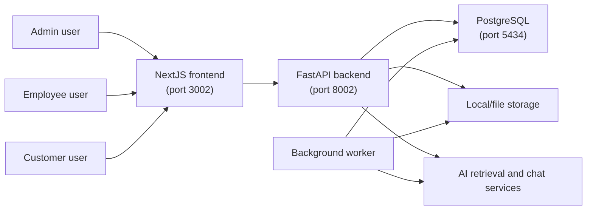
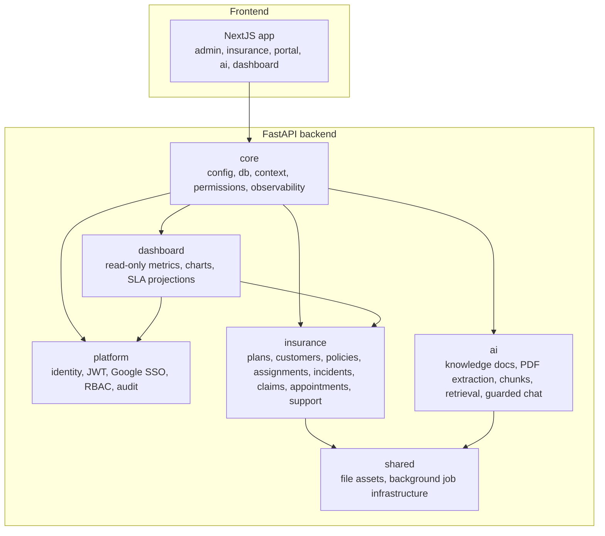

# Insurance Operations Platform Architecture

This document is the architecture source of truth for the Insurance Operations Platform. `docs/PLAN.md` remains the execution backlog; this file defines the boundaries, dependencies and design rules agents must preserve while implementing that backlog.

## Architecture Style

The platform is a modular monolith:

- One FastAPI backend process exposes versioned REST APIs.
- One PostgreSQL database stores tenant-owned operational data.
- One NextJS frontend consumes the backend API.
- Background workers run separately but use the same backend modules and database.
- Modules are bounded by domain ownership, not by deployment unit.

Do not split modules into microservices unless a future ADR documents the reason, trade-offs, migration plan and operational cost.

## C4 Context Snapshot



## C4 Container Snapshot



The diagram shows logical dependency flow, not direct import permission for every arrow. Direct imports must follow the module dependency contract below.

## SOLID Boundaries

- Single responsibility: each service handles one workflow, such as plan management, policy enrollment, incident reporting, claim transition or retrieval chat.
- Open/closed: AI retrieval and answer flows sit behind services so new providers can be added without changing insurance workflows.
- Liskov substitution: storage, embedding and background job providers expose stable contracts.
- Interface segregation: routers depend on narrow services and schemas rather than database models directly.
- Dependency inversion: business workflows depend on repositories, provider abstractions and documented ports rather than framework details.

## Layering Rules

Every backend feature must preserve this direction:

```text
Router -> Service/Application Workflow -> Repository/Provider Port -> Model/Infrastructure
```

Rules:

- Routers handle HTTP only: request parsing, dependency injection, response model selection.
- Services own business rules, authorization decisions beyond coarse route role checks, validation and orchestration.
- Repositories own database access and tenant-scoped query construction.
- Models represent persistence state, not API contracts.
- Schemas/DTOs represent API contracts, not ORM objects.
- Services must not return ORM models directly to routers.
- Repositories must not call routers or services.
- Frontend pages must call API client functions, not duplicate backend business rules.

## Backend Modules

### `core`

Owns:

- App settings and environment mode.
- Database session construction.
- Request context and trusted auth principal access.
- Permission helpers.
- Storage interfaces and observability middleware.

Must not own:

- Insurance workflow state.
- AI retrieval business rules.
- Dashboard metrics.
- Tenant-specific operational decisions.

### `platform`

Owns:

- Organizations, users, memberships, roles and permissions.
- Google SSO adapter.
- JWT session creation and validation.
- Audit and login events.
- Admin user management.

Must not own:

- Insurance policy/claim/customer workflow logic.
- AI document ingestion or chat decisions.
- Dashboard aggregation rules.

### `shared`

Owns:

- File asset infrastructure.
- Background job infrastructure.
- Reusable infrastructure primitives that are not domain workflows.

Must not own:

- Job handler business logic for insurance, AI or dashboard workflows.
- Domain-specific status machines.
- Cross-domain orchestration decisions.

### `insurance`

Owns:

- Insurance plans, customers, policies and assignments.
- Incident reports and claim lifecycle state.
- Appointments, conversations and support messages.
- Customer portal and employee workload queue source data.

Must not own:

- AI provider implementation details.
- Platform identity source of truth.
- Dashboard aggregation ownership.

### `ai`

Owns:

- Knowledge bases, documents and chunks.
- PDF extraction, chunking and retrieval.
- Guarded chat answer generation and AI chat persistence.
- AI provider abstractions.

Must not own:

- Insurance support conversation authorization.
- Claim state.
- Dashboard metrics.

### `dashboard`

Owns:

- Read-only aggregation services.
- Chart DTOs and SLA alert read surfaces.
- Dashboard-specific projections/read models when direct aggregates are no longer sufficient.

Must not own:

- Insurance workflow mutations.
- Claim state transitions.
- Conversation/message command flows.
- Platform auth/audit source state.

## Module Dependency Contract

Allowed:

- Any domain may depend on `core` for configuration, database sessions, request context primitives and observability types.
- Domains may depend on `shared` infrastructure ports for file storage and background job enqueueing.
- Routers may depend on their own domain services and schemas.
- Services may depend on their own repositories and documented cross-domain ports.
- Dashboard may read from source-domain repositories or read models, but only through read-only query contracts.
- Audit logging may be consumed as the platform audit service until an ADR replaces it with a `core` audit port.

Forbidden:

- Routers importing repositories directly.
- Frontend code relying on hardcoded tenant/customer IDs for authorization.
- Dashboard calling command services in `insurance`.
- `insurance` importing AI provider internals or retrieval storage details.
- `ai` mutating insurance conversation or claim state directly.
- Background job handlers living only in `shared` when the job business logic belongs to `insurance`, `ai` or `dashboard`.
- Cross-domain imports that create circular dependencies.

Cross-domain orchestration must use one of these patterns:

- A documented application workflow service in the owning module.
- A narrow port/interface documented in an ADR.
- A background job payload handled by the owning domain.

## Data Ownership

| Data Area | Source Module | Notes |
| --- | --- | --- |
| Organizations, users, roles, memberships | `platform` | Tenant and actor identity source of truth. |
| Audit and login events | `platform` | Shared audit consumer is allowed by current architecture. |
| Plans, customers, policies, assignments | `insurance` | Tenant-owned insurance operations data. |
| Incidents and claim lifecycle | `insurance` | Claim states and transition history belong here. |
| Appointments, conversations, messages | `insurance` | Support workflow source of truth. |
| Knowledge documents and chunks | `ai` | Retrieval must always be tenant-scoped. |
| AI chat sessions/messages | `ai` | AI-native chat state; support conversation state remains in `insurance`. |
| File assets | `shared` | Metadata and storage references only. |
| Background jobs | `shared` infrastructure, owning domain handler | Payloads must include tenant and trace context. |
| Dashboard metrics and SLA reads | `dashboard` read models/projections | Must not mutate workflow state. |

## Key Data Flows

### Customer Portal

1. Frontend calls portal APIs without passing `organization_id` or arbitrary `customer_id`.
2. Backend resolves tenant and actor from trusted request context.
3. `insurance` resolves linked customer from `linked_user_id`.
4. Portal service returns projected policies, incidents, appointments and conversations.
5. Every query is tenant-scoped and customer-scoped.

### Employee Workload Queue

1. Employee/admin calls queue API with filters and pagination.
2. `insurance` queue service applies role/object authorization.
3. Repository returns projection rows, not full graph objects.
4. Queue mutations are idempotent where retryable and emit audit events.
5. Dashboard consumes queue metrics through read-only aggregation.

### Claim Lifecycle

1. Incident reports become the source record for claim lifecycle state.
2. Claim transition service validates state matrix, actor role, required reason and tenant ownership.
3. Transition history is persisted before response.
4. Queue and dashboard views read lifecycle state; they do not own transitions.

Claim state contract:

| State | Meaning | Customer-visible | Terminal |
| --- | --- | --- | --- |
| `reported` | Incident was submitted and awaits triage. | Yes | No |
| `triage` | Employee is validating initial claim information. | Yes | No |
| `in_review` | Claim is under formal review. | Yes | No |
| `approved` | Claim was approved for next operational step. | Yes | No |
| `rejected` | Claim was rejected with a safe external reason. | Yes | Yes |
| `closed` | Claim workflow is complete. | Yes | Yes |
| `reopened` | Closed/rejected claim was reopened by an authorized actor. | Yes | No |

Allowed transitions:

| From | To | Roles | Required metadata |
| --- | --- | --- | --- |
| `reported` | `triage` | `admin`, `employee` | reason |
| `triage` | `in_review` | `admin`, `employee` | reason |
| `in_review` | `approved` | `admin`, `employee` | reason |
| `in_review` | `rejected` | `admin`, `employee` | reason |
| `approved` | `closed` | `admin`, `employee` | reason |
| `rejected` | `reopened` | `admin` | reason |
| `closed` | `reopened` | `admin` | reason |
| `reopened` | `triage` | `admin`, `employee` | reason |

Invalid transitions must be rejected before persistence. Customer role may read scoped claim state but may not transition claims.

### Persisted Support Chat with AI

1. `insurance` owns customer support conversation and message authorization.
2. A documented orchestration service requests guarded AI assistance through an `ai` contract.
3. `ai` retrieval is tenant-scoped and returns bounded citations.
4. Assistant responses are stored in the relevant conversation without logging raw prompts or sensitive message bodies.

AI guardrails:

- Retrieval queries must always filter by `organization_id`.
- Retrieval may only use documents/chunks the current actor is allowed to access.
- Prompt context must be bounded to at most 3 retrieved chunks until a later ADR changes the budget.
- Stored citation payloads must contain safe references such as chunk ids, document ids and titles; they must not duplicate full source text.
- No-source fallback must be deterministic and must not hallucinate policy or claim decisions.
- Provider timeout and provider error paths must return safe fallback responses and preserve the user's original message state.
- Logs and audit metadata must not store raw prompts, raw uploaded document content or full assistant answers.
- AI endpoints and AI-assisted message sends use the `ai-expensive` rate-limit tier.

### Dashboard and SLA

1. `dashboard` queries source data through read-only repositories/projections.
2. SLA evaluation runs in a background job and writes alert records or read-model state owned by dashboard/SLA architecture.
3. Alert links point back to authorized source resources.
4. Dashboard never mutates claim, queue, conversation or policy state.

## API Contract Rules

- API routes live under `/api/v1`.
- Collections must return `items` plus pagination metadata, or document a compatibility exception while migrating existing `ListResponse` usages.
- Every list endpoint must define maximum `limit`, deterministic sorting and tenant-scoped filters.
- Every endpoint must have a rate-limit tier: `auth-sensitive`, `write-command`, `read-list`, `ai-expensive` or `internal-job`.
- DTOs are explicit Pydantic schemas; ORM models must not be returned directly.
- Commands must define idempotency behavior: `X-Idempotency-Key`, get-or-create, repeat-safe state transition or documented non-retryable command.

Standard collection envelope:

```json
{
  "items": [],
  "meta": {
    "limit": 25,
    "sort": "-created_at",
    "next_cursor": null,
    "offset": 0,
    "total": null,
    "has_more": false
  }
}
```

Existing `{"items": [...]}` endpoints are compatibility exceptions. Any task that changes a list endpoint must either add `meta` backward-compatibly or document why the endpoint remains temporarily exempt.

Rate-limit tier definitions:

| Tier | Applies to | Architectural rule |
| --- | --- | --- |
| `auth-sensitive` | login, token exchange, auth verification | Strict per IP/user; log violations. |
| `write-command` | create/update/transition/send commands | Moderate per user/tenant; define idempotency. |
| `read-list` | list/search/filter endpoints | Higher per user/tenant; pagination required. |
| `ai-expensive` | chat, retrieval, ingestion triggers | Strict per user/tenant; bound prompt/retrieval size. |
| `internal-job` | worker-triggered evaluation/ingestion | Bound by worker concurrency and job idempotency. |

## Security and Tenancy Rules

- Production tenant and actor context must come from JWT claims only.
- Demo header auth is local-only and must be disabled in production-like config.
- Client payloads must not be trusted for `organization_id`, role or authorization-relevant customer identity.
- Every database query for tenant-owned data must filter by `organization_id`.
- Object-level authorization happens in services before returning or mutating resource state.
- Audit metadata must include safe actor, tenant, resource and trace context without tokens, raw prompts, full support messages, full claim descriptions or uploaded document contents.

## Frontend Security and Data Exposure Rules

- Sensitive tokens must not be stored in `localStorage`.
- Client-visible `NEXT_PUBLIC_*` variables must contain only non-sensitive configuration such as API base URLs.
- Authenticated sensitive screens must not silently fall back to static demo data after a 401, 403 or backend error.
- Demo fallback data is allowed only for clearly marked public/demo surfaces.
- User-generated text must render through React text nodes; do not use unsanitized HTML rendering.
- Implemented feature actions must not use `href="#"` as primary behavior. Use real links, form buttons or disabled states with server-backed behavior.
- Forbidden and unauthorized states must be shown explicitly and must not trigger cross-role or cross-tenant fallback UI.
- API clients should centralize handling for 401, 403, validation errors and trace ids.

## Idempotency, Audit and PII Rules

Mutation endpoints must define retry behavior before implementation.

| Command class | Idempotency strategy | Duplicate behavior | Audit requirement |
| --- | --- | --- | --- |
| Customer/profile creation | Natural key or `X-Idempotency-Key` | Return existing matching resource or 409 on conflicting payload | actor, tenant, customer id, safe changed fields |
| Policy creation | `X-Idempotency-Key` recommended | Return existing matching policy or 409 on conflict | actor, tenant, policy id, customer id, plan id |
| Appointment request | `X-Idempotency-Key` or get-open-request | Return existing pending/scheduled request when equivalent | actor, tenant, appointment id, customer id |
| Conversation start | Get-or-create open thread per scope | Return existing open thread when equivalent | actor, tenant, conversation id, customer/claim reference |
| Message send | `X-Idempotency-Key` for client retries | Return existing message for same key; never duplicate | actor, tenant, conversation id, message id, body length only |
| Queue assignment/action | Repeat-safe state update or version check | No-op if already in requested state; 409 for stale/conflicting update | actor, tenant, queue item id, previous/new state |
| Claim transition | State-machine idempotency plus transition key | No-op or return existing transition when same request is repeated; reject invalid transition | actor, tenant, claim id, previous/new state, reason category |
| SLA job evaluation | Job idempotency key by tenant/rule/window | Update existing active alert; no duplicate active alerts | job id, tenant, rule id, alert id/count |
| AI answer generation | Conversation/message idempotency key | Avoid duplicate assistant message for retried request | actor, tenant, conversation id, message id, citation ids only |

Audit metadata must include:

- `organization_id`
- `actor_user_id` or job actor
- `action`
- `resource_type`
- `resource_id`
- `trace_id` when available
- safe metadata needed for support/debugging

Audit and logs must not include:

- bearer tokens, refresh tokens, session secrets or API keys
- raw AI prompts
- raw uploaded document contents
- full support message bodies
- full claim descriptions or medical/incident detail narratives
- full PII values when an id/reference is sufficient

Logging guidance:

- Log command success/failure with ids and counts, not raw content.
- Truncate upstream/provider errors before returning or logging.
- Use DEBUG for noisy request details and INFO for lifecycle-level events only.
- Security violations such as tenant mismatch should be auditable and visible without exposing sensitive payloads.

## Performance Rules

- No unbounded list endpoints.
- Use projection queries for portal summaries, queues, conversation lists and dashboard cards.
- Avoid N+1 service loops when assembling related rows.
- Add indexes with migrations for common predicates: tenant, customer, employee, status, due date, created date and source-resource references.
- Use offset pagination for small/admin lists where page numbers matter; use cursor pagination for append-only or high-volume histories such as messages, audit events and SLA alerts.
- Dashboard aggregation should use aggregate queries or read models, not per-row loops.

## Query and Index Budget

Every list, dashboard or history endpoint must document its query shape before implementation. Query budgets are design targets; agents must validate them with tests and query-plan review when implementation reaches the database layer.

| Flow | Tables | Required predicates | Sort | Projection rule | Index guidance |
| --- | --- | --- | --- | --- | --- |
| Customer portal summary | `insurance_customers`, `insurance_policies`, `insurance_incident_reports`, `insurance_appointments`, `insurance_conversations` | `organization_id`, resolved `linked_user_id` or `customer_id` | `-created_at` for recent items | Summary DTO only | customer `(organization_id, linked_user_id)`, policies/incidents/appointments/conversations `(organization_id, customer_id, created_at)` |
| Portal histories | policies, incidents, appointments, conversations | `organization_id`, `customer_id`, optional status/date filters | `-created_at` or scheduled date | Row DTO only | `(organization_id, customer_id, status, created_at)` where status is filtered |
| Employee queue | assignments, incidents, appointments, conversations | `organization_id`, `employee_user_id`, status, priority, due/activity date | `due_at,+priority,-updated_at` | Queue row DTO only | `(organization_id, employee_user_id, status, due_at)`, `(organization_id, status, due_at)` |
| Claim detail/history | incidents, claim transition history | `organization_id`, claim/incident id | `created_at` for history | Detail DTO and transition DTO | incidents `(organization_id, id)`, history `(organization_id, claim_id, created_at)` |
| Conversation list | conversations, latest message metadata | `organization_id`, customer/employee/claim filters | `-last_message_at` | Thread list DTO only | `(organization_id, customer_id, last_message_at)`, `(organization_id, employee_user_id, last_message_at)` |
| Message history | messages | `organization_id`, `conversation_id`, cursor | `created_at` | Message DTO only | `(organization_id, conversation_id, created_at)` |
| Dashboard metrics | workflow source tables or read models | `organization_id`, state/status/date range | bucket start or status | Aggregate DTO only | indexes match metric predicates; use aggregate SQL/read models |
| SLA alerts | alert/read model tables | `organization_id`, status, due/breach time, owner | `-created_at` or due date | Alert row DTO only | `(organization_id, status, due_at)`, `(organization_id, owner_user_id, status)` |
| Audit events | audit_events | `organization_id`, actor/resource/action/date | `-created_at` | Audit row DTO with safe metadata | `(organization_id, created_at)`, `(organization_id, resource_type, resource_id)` |

N+1 review gate:

- Services that combine related records must use joins, batched lookups or explicit projection queries.
- Repository methods used by dashboard and queue pages must return screen-ready DTO data, not ORM graphs that force per-row follow-up queries.
- Tests for list endpoints must include at least one multi-row case that would reveal incorrect object scoping or missing joins.
- If a task intentionally defers an index because data volume is known to be tiny, it must document the low-volume exception and the trigger for adding the index later.

## Background Job Ownership

`shared` owns job infrastructure only. Domain/application modules own job payload semantics and handlers.

Required async workflow rules:

- No fire-and-forget work inside request handlers.
- Job payloads include tenant id, trace id, job type, idempotency key where applicable and minimal resource references.
- Jobs define retry, dedupe and poison-job behavior.
- PDF ingestion, SLA evaluation and potentially long AI answer generation should use background jobs when request latency or reliability requires it.

## Migration Strategy

Schema changes affecting existing rows must prefer expand/backfill/contract:

1. Expand: add nullable/new structures without breaking current code.
2. Backfill: populate existing data deterministically.
3. Contract: enforce constraints and remove legacy fields only after compatibility is proven.

Single-step migrations are allowed only when the table is empty, the field is non-breaking, or an ADR documents why the risk is acceptable.

Upcoming migration-sensitive areas:

- Claim lifecycle state and transition history.
- Queue priority, due date and assignment state fields.
- Conversation links to customer/claim support contexts.
- SLA policy/config and alert persistence.

## Architecture Decision Records

Major decisions must be captured in `docs/adr/` before implementation agents encode them in code. Current ADRs:

- [ADR 0001: Modular monolith boundaries](adr/0001-modular-monolith-boundaries.md).
- [ADR 0002: Production auth and tenant resolution mode](adr/0002-production-auth-and-tenant-resolution.md).
- [ADR 0003: Collection pagination envelope and rate-limit tiers](adr/0003-collection-pagination-and-rate-limits.md).
- [ADR 0004: Claim lifecycle ownership and state machine](adr/0004-claim-lifecycle-ownership.md).
- [ADR 0005: Support chat AI orchestration boundary](adr/0005-support-chat-ai-orchestration.md).
- [ADR 0006: Dashboard read model and SLA alert ownership](adr/0006-dashboard-read-model-and-sla-ownership.md).
- [ADR 0007: Background job execution and retry model](adr/0007-background-job-execution-and-retry-model.md).

Each ADR must include context, decision, alternatives considered, consequences and review date.

## Runtime Ports

- Frontend: `3002`
- Backend: `8002`
- PostgreSQL: `5434`
